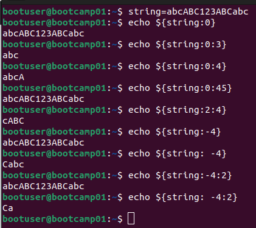
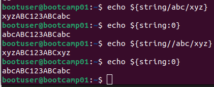
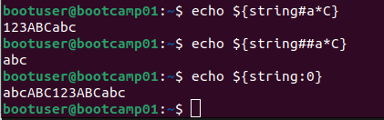

### Strings

```shell
echo ${string:0}. Sin longitud, extrae la cadena entera
```


```shell
echo ${string/abc/xyz}
echo ${string//abc/xyz}
```



```shell
# Borra la coincidencia mas corta desde el principio de la cadena
echo ${string#a*C}
# Borra la coincidencia mas larga desde el principio de la cadena
echo ${string##a*C}
```



```shell
# Borra la coincidencia mas corta desde el final de la cadena
echo ${string%A*c}
# Borra la coincidencia mas larga desde el final de la cadena
echo ${string%%A*c}
```

```shell
# ejemplo
pruebacadena=/home/bootuser/Documentos/pruebacadena.txt
# Eliminar el sufijo del nombre del fichero para averiguar el path
echo ${pruebacadena%/*t}
# En el fondo me da igual como termine el nombre del fichero, por eso no hace falta la t
echo ${pruebacadena%/*}
# Ahora quiero el nombre del fichero
echo ${pruebacadena##/*/}
# Igual que antes, me da igual como empiece la ruta, por eso no hace falta la / inicial
echo ${pruebacadena##*/}
# Ahora quiero la extension del archivo
echo ${pruebacadena##*.}
# Si quieres sacar el nombre del fichero sin la extension
```

### crontab


- Recomendable definir en script en variables las rutas que vamos a utilizar, por ejemplo a la hora de guardar/crear ficheros, y luego utilizar esas variables dentro del script.
- Cambiar permisos a chmod +x al script.
- Con el primer crontab -e te pide el editor a usar.

```shell
#!/bin/bash
### crontest.sh
### Ejemplo sencillo, definimos la ruta, y luego la usamos para crear fichero.
ruta="/home/bootuser/Documentos/scripts/"
touch $ruta/ficherito.txt
```

```shell
# En crontab, se ejecuta cada minuto
* * * * * /home/bootuser/Documentos/scripts/crontest.sh
```

#### Webs para generar y ejemplos

- [Para ver ejemplos y entender como funciona](https://crontab.guru/)
- [Para fabricarte los crontab](https://crontab-generator.org/)
- [Con algunos ejemplos, como tema editar el cron de otros usuarios](https://blog.desdelinux.net/cron-crontab-explicados/)

#### Editor por defecto

```shell
select-editor
```

Si la opcion de antes no la tenemos, podemos hacer lo siguiente:

```shell
# Editas fichero
vi ~/.bash_profile
# Add this line to the file
export VISUAL="gedit"
# Recargas con estas dos opciones
source ~/.bashrc  
. ~/.bashrc
```

### ntp

[Enlace con ntpdate y ntp](https://linuxhint.com/ntpdate-command-linux/)

#### ntpdate
- Lo malo de esto es que te tienes que montar un crontab que ejecute el tema de la hora cada x tiempo, pero te puede sacar del apuro para tener en hora el servidor cuando tienes que hacer algo.
```shell
sudo apt install ntpdate
sudo ntpdate hora.roa.es
# Esto no te saca el log en pantalla, mejor para scripts
sudo ntpdate -s hora.roa.es
```

#### ntp
- Lo mejor al final es instalar el paquete ntp, que te monta el servicio y mantiene el equipo con la hora actualizada.