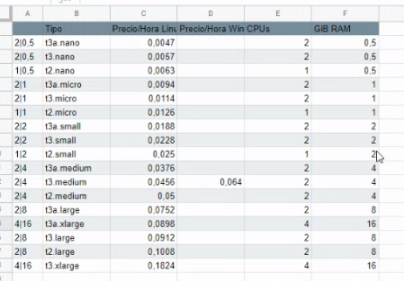

## AWS

### MFA

Se lo puedes eliminar a los usuarios, tener varios MFA, resincronizar, etc.


#### Claves de acceso

Para el tema de que una máquina ejecute algo, te tienes que ir al usuario, credenciales de seguridad, Claves de acceso. Puedes entrar a traves del IAM, Usuarios, seleccionas usuario.

Sirve también para el tema de las consolas de Cloudshell, que puedes entrar por navegador, o lo tienes instalado en tu pc.

**SOLO TIENES UN MAXIMO DE 2 CLAVES DE ACCESO**


Acceder desde el CLI:
- IAM
- Usuarios
- Seleccionas usuarios
- Credenciales de seguridad
- Crear clave de acceso
- Le pones una etiqueta.
- Te tienes que copiar los dos valores.


- Clave de acceso: AKAKAKAKAKAKAKAK
- Clave de acceso secreta: KAKAKAKAKAKAKAKA


### Instalar Cloudshell AWS

```shell
curl "[https://awscli.amazonaws.com/awscli-exe-linux-x86_64.zip](https://awscli.amazonaws.com/awscli-exe-linux-x86_64.zip)" -o "awscliv2.zip"
unzip awscliv2.zip
sudo ./aws/install
```

Utilizamos el siguiente comando para configurar aws cli. Nos pedira los datos obtenidos anteriormente al crear la clave, además de la región y el output format.
```shell
aws configure
```

- Enlace https://docs.aws.amazon.com/cli/latest/userguide/cli-chap-configure.html
- Enlace https://docs.aws.amazon.com/cli/latest/userguide/cli-usage-output-format.html


### VPC

- Puedes tener tantas redes virtuales como quieras
- Las IPs elasticas tienen coste si no estan asociadas a una maquina que este encendida.
- Tienes un limite de 5 IPs elasticas. Puedes pedir mas.
- Internet Gateway es un producto relacionado, permite conectar el VPC a Internet.
- Transit Gateway permite conectar varias VPCs y tambien VPNs y AWS Direct Connect. Sirven para unir dos subredes en distintas zonas de disponibilidad.
- VPC peering permite enrutar entre dos VPCs, no se suele usar mucho
- Se puede hacer mirroring del trafico, tipo para analizar trafico, monitorizar, etc.
- Conexiones de VPN, site to site, client VPN, dispositivo  de VPN por software de terceros, cloudhub VPN,...
- El NAT se pone en la parte pública, y tiene un coste.


### Etiquetas

- Etiquetar cuanto más mejor, cuanto antes mejor, y todo, mejor todavía.
- Se puede etiquetar más tarde desde el Tag Editor y desde los propios recursos.
- Si cambias una etiqueta, a nivel de costes, no actualiza hacia atrás, te reconoce el valor anterior hasta la fecha del cambio, y el nuevo a partir de esa fecha.
- La etiqueta Name es más que aconsejable utilizarla, es la que viene casi por defecto.
- Llevar cuidado, porque las etiquetas se pueden escribir con el mismo nombre, pero en mayus minus, y son diferentes. Vamos, case sensitive.

### Costes



#### Ejercicio de crear VPC y sus cosas desde consola

https://docs.aws.amazon.com/es_es/vpc/latest/userguide/vpc-subnets-commands-example.html#vpc-subnets-commands-example-create-vpc

```shell
#### Ejercicio de crear VPC y sus cosas desde consola
# 
## Primero
aws ec2 create-vpc --cidr-block 10.0.0.0/16 --query Vpc.VpcId --output text

vpc-02af3acbfa2daff70


## Segundo
aws ec2 create-subnet --vpc-id vpc-02af3acbfa2daff70 --cidr-block 10.0.5.0/24


## Tercero
aws ec2 create-internet-gateway --query InternetGateway.InternetGatewayId --output text

igw-0fdc2291a64fe5a8f

aws ec2 attach-internet-gateway --vpc-id vpc-02af3acbfa2daff70 --internet-gateway-id igw-0fdc2291a64fe5a8f


## Cuarto
aws ec2 create-route-table --vpc-id vpc-02af3acbfa2daff70 --query RouteTable.RouteTableId --output text

rtb-02a23879aabb66b2f


## Quinto
aws ec2 create-route --route-table-id rtb-02a23879aabb66b2f --destination-cidr-block 0.0.0.0/0 --gateway-id igw-0fdc2291a64fe5a8f


## Sexto
aws ec2 describe-route-tables --route-table-id rtb-02a23879aabb66b2f


## Septimo
aws ec2 describe-subnets --filters "Name=vpc-id,Values=vpc-02af3acbfa2daff70" --query "Subnets[*].{ID:SubnetId,CIDR:CidrBlock}"

10.0.5.0/24     subnet-0dcc3bd786e3de175


## Octavo
aws ec2 associate-route-table  --subnet-id subnet-0dcc3bd786e3de175 --route-table-id rtb-02a23879aabb66b2f


## Noveno

aws ec2 modify-subnet-attribute --subnet-id subnet-0dcc3bd786e3de175 --map-public-ip-on-launch
```


#### Referencia de un pavo de Github para crear VPC

If you don’t have the CLI configured download and configure it :
http://docs.aws.amazon.com/cli/latest/userguide/installing.html


I have emphasized tagging everything you create because it will save a lot of frustration later when trying to figure out which resource is which.


Here are the steps:

Create VPC:
```console 
aws ec2 create-vpc --cidr-block 10.0.0.0/16
```

Tag That VPC:
```console 
aws ec2 create-tags --resources vpc-d363afab --tags Key=Name,Value=CLI-VPC
```

Create a public Subnet:
```console 
aws ec2 create-subnet --vpc-id vpc-d363afab --cidr-block 10.0.1.0/24
```

Tag:
```console 
aws ec2 create-tags --resources subnet-7314ad17 --tags Key=Name,Value=CLI-Public-Subnet
```

Create a private Subnet:
```console 
aws ec2 create-subnet --vpc-id vpc-d363afab --cidr-block 10.0.2.0/24
```
Tag:
```console 
aws ec2 create-tags --resources subnet-4109b025 --tags Key=Name,Value=CLI-Private-Subnet
```

Create an Internet Gateway:
```console 
aws ec2 create-internet-gateway
```

Tag:
```console 
aws ec2 create-tags --resources igw-afdd01d6 --tags Key=Name,Value=CLI-Internet-Gateway
```

Attach Internet Gateway:
```console 
aws ec2 attach-internet-gateway --internet-gateway-id igw-5d685a38 --vpc-id vpc-d363afab
```


Allocate Elastic IP:
```console 
aws ec2 allocate-address --domain vpc
```

Create a Nat-gateway and place it in the public Subnet:
```console 
aws ec2 create-nat-gateway --subnet-id subnet-1a2b3c4d --allocation-id eipalloc-37fc1a52
```

Tag:
```console 
aws ec2 create-tags --resources nat-0e4d97e539eadf232 --tags Key=Name,Value=CLI-Nat-Gateway
```

Create Route Table 1 for public Subnet:
```console 
aws ec2 create-route-table --vpc-id vpc-d363afab 
# Tag
aws ec2 create-tags --resources rtb-14c3736e --tags Key=Name,Value=CLI-PUBLIC_RT
```

Create Route Table 2 for private Subnet:

```console 
aws ec2 create-route-table --vpc-id vpc-d363afab 

#Tag:

aws ec2 create-tags --resources rtb-cbc070b1 --tags Key=Name,Value=CLI-PRIVATE_RT 
```


Create a route to the internet in Route Table 1:
```console 
aws ec2 create-route --route-table-id rtb-14c3736e --destination-cidr-block 0.0.0.0/0 --gateway-id igw-afdd01d6
```

Create a route to the internet in Route Table 2 via Nat:
```console 
aws ec2 create-route --route-table-id rtb-cbc070b1 --destination-cidr-block 0.0.0.0/0 -- gateway-id nat-0e4d97e539eadf232
```

Associate Route Table 1 to PublicSubnet :
```console 
aws ec2 associate-route-table --route-table-id rtb-14c3736e --subnet-id subnet-7314ad17
```

Associate Route Table 2 to PrivateSubnet:
```console 
aws ec2 associate-route-table --route-table-id rtb-1245623e --subnet-id subnet-234567as
```

Create a Security Group for Web Access and SSH:
```console 
aws	ec2	create-security-group	--group-name	CLI-WEB-SecurityGroup --description	"My
security	group" --vpc-id vpc-d363afab
```

Tag:
```console 
aws ec2 create-tags --resources sg-03ca1371 --tags Key=Name,Value=CLI_SECURITY_GROUP
Add Ingress Port 22 and 80:
```

Create Key Pair and copy the key part and write it to a file MyKeyPairCLI.pem :
```console 
aws ec2 create-key-pair --key-name MyKeyPairCLI
```

Change the permissions on that file to restrict access:
```console 
chmod 400 MyKeyPairCLI.pem
```

Launch EC2 Instance In public subnet with Amazon AMI ami-8c1be5f6 :
```console 
aws ec2 run-instances --image-id ami-8c1be5f6 --count 1 --instance-type t2.micro --key- name MyKeyPairCLI --security-group-ids sg-c3ed34b1 --subnet-id subnet-7314ad17 -- associate-public-ip-address
```

TAG EC2:
```console 
aws ec2 create-tags --resources i-05c8b15394d0905b8 --tags Key=Name,Value=CLI_EC2
```

Describe Instance to get the IP or check the console:
```console 
aws ec2 describe-instances
```

SSH into your web browser:
```console 
ssh ec2-user@34.34.234.4 -i MyKeyPairCLI.pem
```


And you’re now logged in! Have fun with your setup.