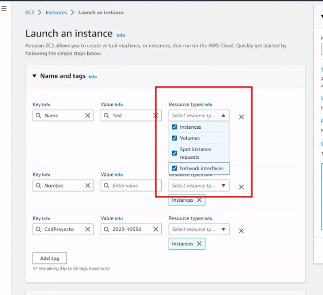
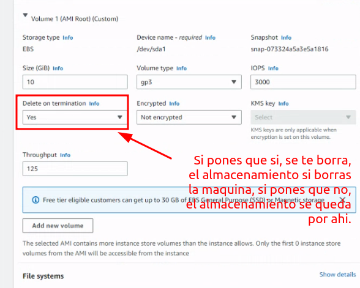
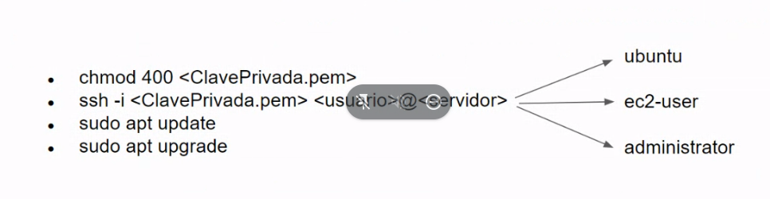

## EC2

- Llevar especial atencion al tema de la hora y el idioma.

https://aws.amazon.com/es/ec2/instance-types/


### Creacion de EC2

- Importante etiquetar al principio todos los recursos que va a utilizar la instancia.



- Tema disco





- En la instancia tienes acciones, y hay una opcion para habilitar que no termines/borres la instancia accidentalmente.

### Cambiar la timezone

- Entras con el usuario por SSH.
```shell
# Cambias a root
sudo su -
```

```shell
# Con esto sale Europe/Madrid, pero vamos, es simplemente por verificar
timedatectl list-timezones | grep Madrid
```

```shell
# Con esto cambias el Time Zone
timedatectl set-timezone Europe/Madrid
```


### Parando una instancia

```shell
aws ec2 stop-instances --instance-id id_de_la_instancia
```